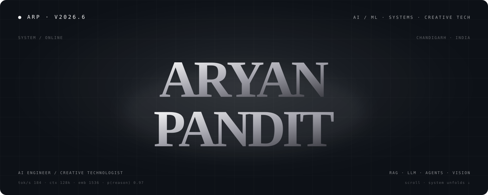
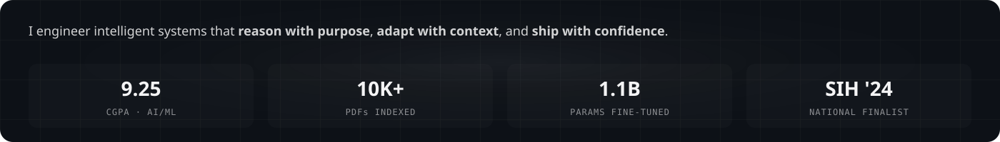
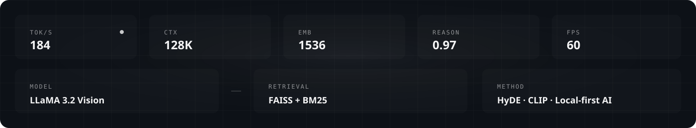
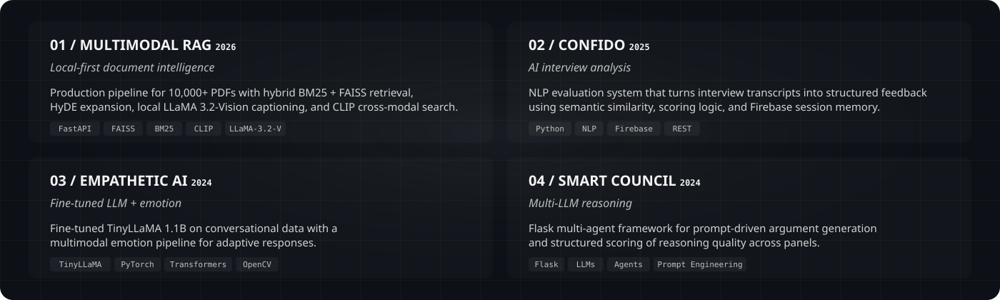
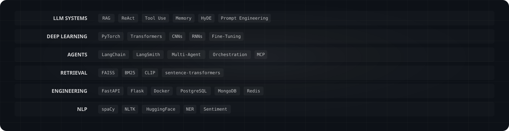
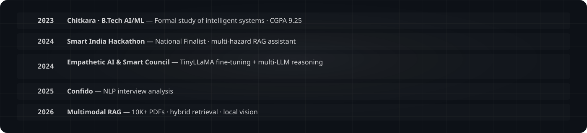

<!-- ARP · v2026.6 — GitHub Profile README -->
<!-- Designed as the compact technical edition of aryanrudrpandit.dev -->

  <picture>
    <source media="(prefers-color-scheme: dark)" srcset="./assets/hero.svg">
    <source media="(prefers-color-scheme: light)" srcset="./assets/hero.svg">
    
  </picture>

 

## 01 / MANIFEST

  

---

## 02 / SYSTEM STATUS

  

---

## 03 / SELECTED SYSTEMS

  

---

## 04 / STACK

  

---

## 05 / JOURNEY

  

---

## 06 / GITHUB SIGNAL

  

 
<table width="100%">
  <tr>
    <td width="50%" align="center">
      
    </td>
    <td width="50%" align="center">
      
    </td>
  </tr>
</table>

---

## 07 / SIGNAL

  

---

  <picture>
    <source media="(prefers-color-scheme: dark)" srcset="./assets/footer.svg">
    <source media="(prefers-color-scheme: light)" srcset="./assets/footer.svg">
    
  </picture>

